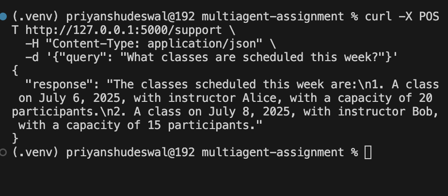
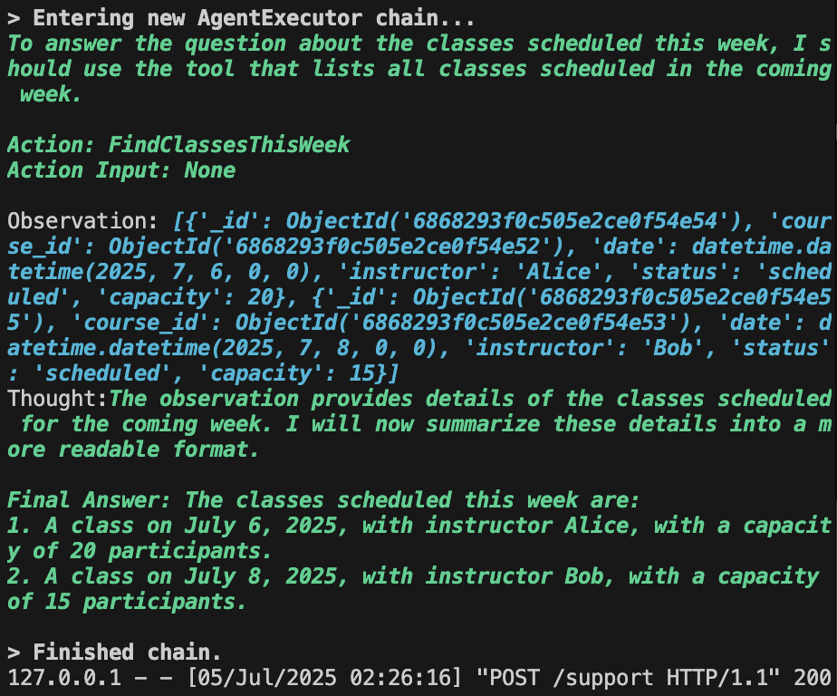
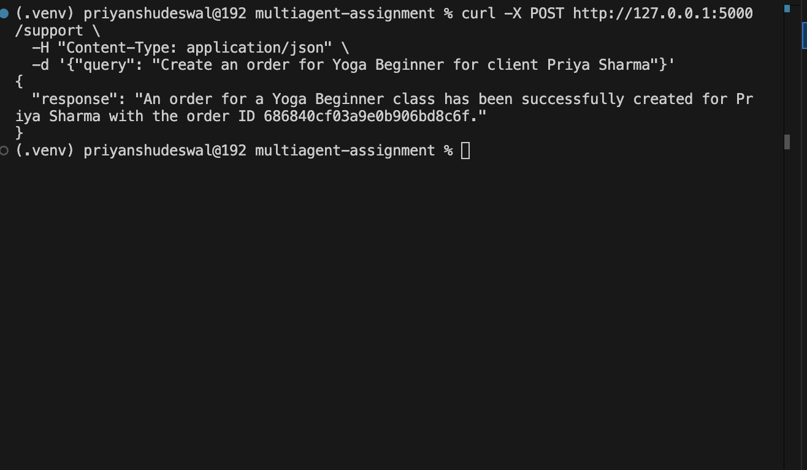
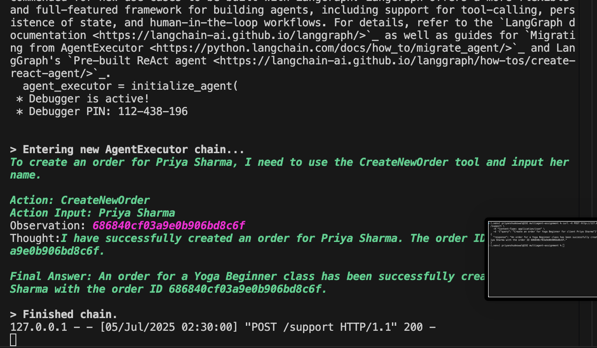
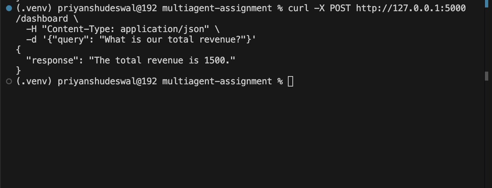
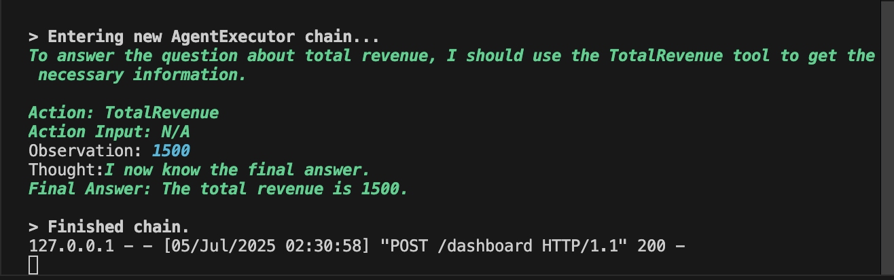
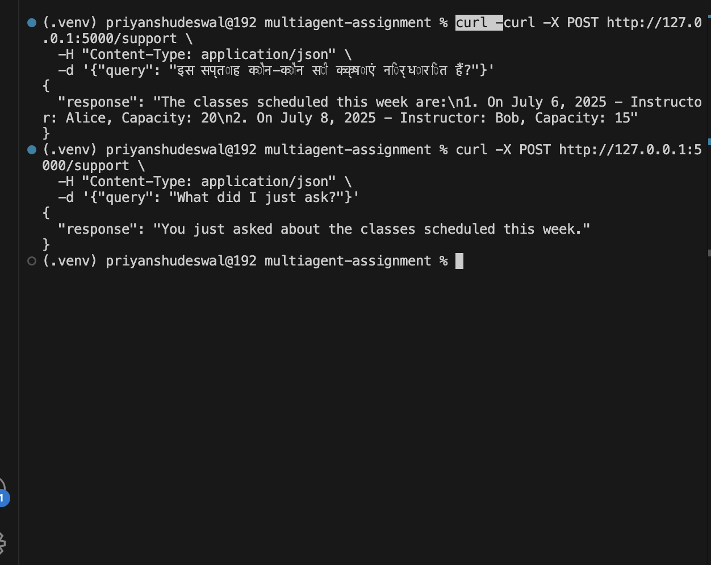
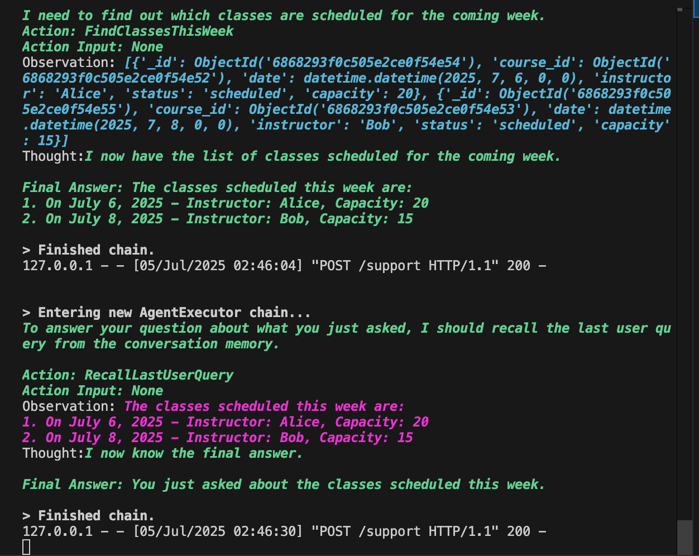

# 🧠 Multi-Agent AI System – Support & Analytics Agents

This project implements a **multi-agent system** using [LangChain](https://www.langchain.com/) , where two agents serve distinct but complementary business roles:

- 🎧 **Support Agent**: Handles client support, course/class info, and order/payment queries.
- 📊 **Dashboard Agent**: Provides analytics and insights for business decision-making.

Backend is powered by **Flask**, **MongoDB**, and **LangChain**; while the frontend is hosted via **Streamlit**.

### 🌐 Hosted Frontend

👉 [Live Demo on Streamlit](https://lcpftnbpmstbnvxreygrsl.streamlit.app/)

---

## 🔧 Features

### 👩‍💼 Support Agent
- Get course/class info (by instructor, status, date)
- Order/payment status by ID or client
- Client info by name/email/phone
- Create new client enquiries and orders
- Multilingual query support (e.g. Hindi)

### 📈 Dashboard Agent
- Revenue & outstanding dues
- Top courses by enrollment
- Attendance %, drop-off rates
- Active vs inactive clients

### 🧠 Memory & Multilingual Support
- Retains conversation history for follow-up queries
- Translates non-English input (e.g., Hindi → English) before execution

---
## 📁 Folder Structure

```bash
MULTIAGENT-ASSIGNMENT/
├── backend/
│   ├── agents/
│   │   ├── dashboard_agent.py          # Analytics Agent
│   │   └── support_agent.py            # Support & Service Agent
│   ├── models/
│   │   ├── schemas.py                  # MongoDB Schemas & Connection
│   │   └── seed_data.py                # Initial data for testing
│   ├── tools/
│   │   ├── external_api.py             # Simulated client/order creation API
│   │   └── mongodb_tool.py             # CRUD & Aggregation Helpers
│   ├── app.py                          # Main Flask app with API routes
├── frontend.py                         # Optional Streamlit interface (hosted)
├── requirements.txt                    # Python dependencies
├── .env                                # Environment variables (Mongo URI, API keys)
├── screenshots/
│   ├── 1.png, 1.1.png                  # Example 1: Query + Logs
│   ├── 2.png, 2.2.png                  # Example 2: Query + Logs
│   ├── 3.png, 3.3.png                  # Example 3: Query + Logs
│   ├── 4.png, 4.4.png                  # Example 4: Multilingual + Memory
```
---

### 🖼️ Example Screenshots

#### 🔹 Example 1: Query for classes this week
| Query Terminal Logs | Server Terminal |
|---------------------|--------------|
|  |  |

#### 🔹 Example 2: Creating an Order
|Query Terminal Logs | Server Terminal |
|---------------------|--------------|
|  |  |

#### 🔹 Example 3: Extracting Total Revenue
| Query Terminal Logs | Server Terminal |
|---------------------|--------------|
|  |  |

#### 🔹 Example 4: Multilingual Query + Memory Recall
| Query Terminal Logs | Server Terminals |
|---------------------|--------------|
|  |  |

## In Screenshot 4, the query was made in Hindi and automatically translated. The next query, "what did I ask earlier?", demonstrates memory recall capability.
---
## 🛠 Setup & Run Instructions

Follow these steps to set up and run the Multi-Agent AI backend + frontend on your local system.

---

### 1️⃣ Clone the Repository

```bash
git clone https://github.com/your-username/multiagent-assignment.git
cd multiagent-assignment
```
### 2️⃣ Install Python Dependencies
```
pip install -r requirements.txt

```
### 3️⃣ Set Up Environment Variables
Create a .env file in the root directory:
```
OPENAI_API_KEY=your_openai_key
MONGODB_URI=your_mongo_connection_uri
```
### 4️⃣ Seed the MongoDB Database
This step populates the database with mock data (courses, clients, payments, etc.).
```
cd backend/models
python seed_data.py

```
### 5️⃣ Start the Flask Server
```
cd ../../backend
python app.py
```
---
## 📡 Available Endpoints

| Endpoint       | Method | Description                             |
|----------------|--------|-----------------------------------------|
| `/support`     | POST   | Send queries to the Support Agent       |
| `/dashboard`   | POST   | Send queries to the Dashboard Agent     |

### 🔍 Sample Request Format (JSON)

```json
{
  "query": "What classes are available this week?"
}
```
## 🧠 Notes:
-Input should be a natural language query in the query field.

-Non-English queries are automatically translated to English using Google Translate.

-Responses are always returned in English.

-Memory is preserved per agent instance (useful for contextual follow-ups).


